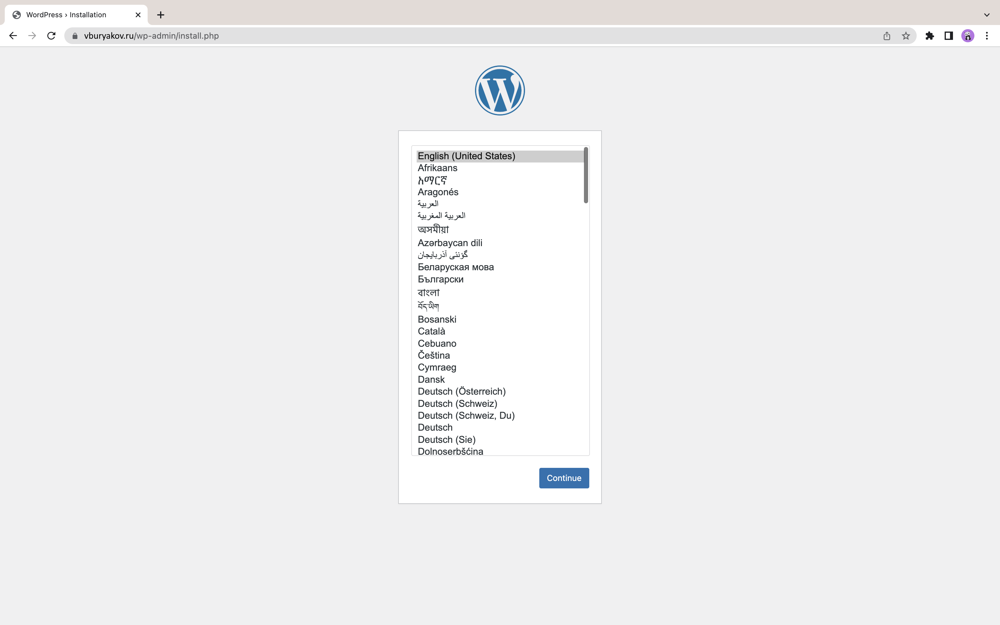
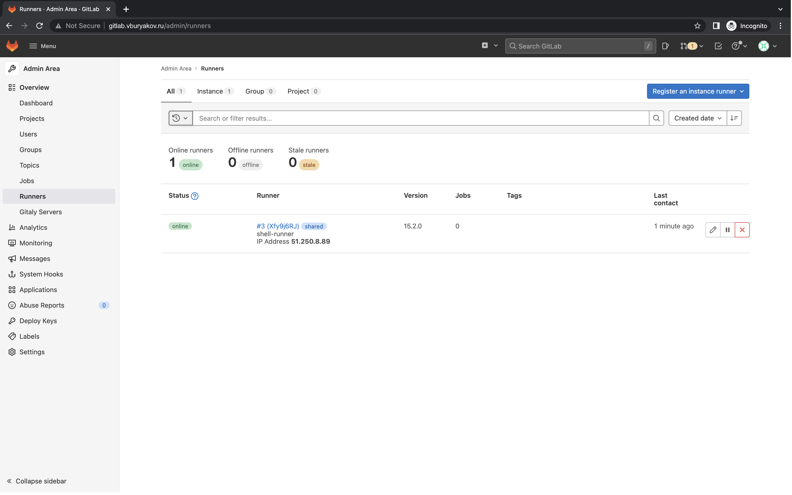

# Дипломный практикум в YandexCloud

## Подготовка к работе

1. Создадим домен `vburyakov.ru` на [reg.ru](https://www.reg.ru/). Пропишем
   DNS-серверы (`ns1.yandexcloud.net`, `ns2.yandexcloud.net`).


2. Создадим новый workspace `devops-diplom` в Terraform Cloud.


## Terraform

Подготовим инфраструктуру в Yandex Cloud при помощи Terraform. Файлы конфигурации доступны по [ссылке](terraform).

**Краткое описание**

* В `provider.tf` добавим конфигурацию провайдера `yandex`:

```terraform
terraform {
  required_providers {
    yandex = {
      source  = "yandex-cloud/yandex"
      version = "0.75.0"
    }
  }
}

provider "yandex" {
  token     = var.YANDEX_TOKEN
  cloud_id  = var.yandex_cloud_id
  folder_id = var.yandex_folder_id
  zone      = "ru-central1-a"
}
```

* В `variables.tf` добавим Яндекс токен и идентефикаторы облака:

```terraform
variable "YANDEX_TOKEN" {}

variable "yandex_folder_id" {
  default = "b1gcedqh2opsb3qdvctm"
}

variable "yandex_cloud_id" {
  default = "b1grvrc5vladcufpdjjn"
}

variable "SSH_ID_RSA_PUB" {}
```

* В `main.tf` добавим конфигурацию backend:

```terraform
terraform {
  cloud {
    organization = "vburyakov"

    workspaces {
      name = "devops-diplom"
    }
  }
}
```

* В `main.tf` добавим настройки всех инстансов. Пример, настройки для сервера `app.vburyakov.domain`:

```terraform
resource "yandex_compute_instance" "app_instance" {
  name = "wordpress"
  zone = "ru-central1-a"

  resources {
    cores  = 4
    memory = 4
  }

  boot_disk {
    initialize_params {
      image_id = "fd81d2d9ifd50gmvc03g"
      size     = 10
    }
  }

  network_interface {
    subnet_id = yandex_vpc_subnet.private_vpc_subnet.id
  }

  metadata = {
    ssh-keys = "ubuntu:${file("~/.ssh/id_rsa.pub")}"
  }
}
```

* В `nextwork.tf` добавим сетевые настройки.
* В `output.tf` добавим вывод настроек доступа и IP-адресов.

### Запуск Terraform

1. Выполним `terraform init`:

```shell
terraform init


Initializing Terraform Cloud...

Initializing provider plugins...
- Finding yandex-cloud/yandex versions matching "0.75.0"...
- Installing yandex-cloud/yandex v0.75.0...
- Installed yandex-cloud/yandex v0.75.0 (self-signed, key ID E40F590B50BB8E40)

...

Terraform Cloud has been successfully initialized!

You may now begin working with Terraform Cloud. Try running "terraform plan" to
see any changes that are required for your infrastructure.

If you ever set or change modules or Terraform Settings, run "terraform init"
again to reinitialize your working directory.
```

2. Выполним `terraform validate`:

```shell
terraform validate

Success! The configuration is valid.
```

3. В Terraform Cloud добавим переменные окружения:

* `TF_VAR_YANDEX_TOKEN` — по [инструкции](https://cloud.yandex.com/en/docs/iam/concepts/authorization/oauth-token).
* `TF_VAR_SSH_ID_RSA_PUB` — копируем из `cat ~/.ssh/id_rsa.pub`.

Выполним `terraform plan`:

```shell
terraform apply --auto-approve

...
Plan: 18 to add, 0 to change, 0 to destroy.

Changes to Outputs:
  + app_vburyakov_ru_ip_addr_internal        = (known after apply)
  + db01_vburyakov_ru_ip_addr_internal       = (known after apply)
  + db02_vburyakov_ru_ip_addr_internal       = (known after apply)
  + gitlab_vburyakov_ru_ip_addr_internal     = (known after apply)
  + host_vburyakov_ru_ip_addr_external       = (known after apply)
  + monitoring_vburyakov_ru_ip_addr_internal = (known after apply)
  + ssh_config                                = (known after apply)
```

4. Выполним `terraform apply --auto-approve`.

```shell
terraform apply --auto-approve

...
Apply complete! Resources: 18 added, 0 changed, 0 destroyed.
...
```

После создания инфраструктуры проверим Terraform Cloud:


Также проверим UI Yandex Cloud:

* **Виртуальные машины**


* **Зона DNS**


Инфраструктура **успешно** развёрнута.

## Ansible

Подготовим роли Ansible для созданной инфраструктуры. Файлы конфигурации доступны по [ссылке](ansible).

**Краткое описание**

* В `roles/common` добавим общие сценарии для установки Docker, Docker Compose и Node exporter.
* В `roles/entrance` добавим роль для работы основного сервера.
* В `roles/mysql` добавим роль для работы кластера MySQL.
* В `roles/wordpress` добавим роль для работы WordPress.
* В `roles/monitoring` добавим роль для работы Prometheus, Alert Manager и Grafana.

Для работы Ansible необходимо добавить IP-адреса:

1. Добавим значение output-переменной Terraform в `~/.ssh/config`:

```shell
Host vburyakov.ru
  HostName 51.250.94.37
  User ubuntu
  IdentityFile ~/.ssh/id_rsa
  
Host db01.vburyakov.ru
  HostName 10.100.1.12
  User ubuntu
  IdentityFile ~/.ssh/id_rsa
    ProxyJump ubuntu@51.250.94.37
    ProxyCommand ssh -W %h:%p -i .ssh/id_rsa

Host db02.vburyakov.ru
  HostName 10.100.1.3
  User ubuntu
  IdentityFile ~/.ssh/id_rsa
    ProxyJump ubuntu@51.250.94.37
    ProxyCommand ssh -W %h:%p -i .ssh/id_rsa

Host app.vburyakov.ru
  HostName 10.100.1.26
  User ubuntu
  IdentityFile ~/.ssh/id_rsa
    ProxyJump ubuntu@51.250.94.37
    ProxyCommand ssh -W %h:%p -i .ssh/id_rsa

Host monitoring.vburyakov.ru
  HostName 10.100.1.27
  User ubuntu
  IdentityFile ~/.ssh/id_rsa
    ProxyJump ubuntu@51.250.94.37
    ProxyCommand ssh -W %h:%p -i .ssh/id_rsa

Host gitlab.vburyakov.ru
  HostName 10.100.1.30
  User ubuntu
  IdentityFile ~/.ssh/id_rsa
    ProxyJump ubuntu@51.250.94.37
    ProxyCommand ssh -W %h:%p -i .ssh/id_rsa
```

2. Очистим файл `known_hosts` командой `echo "" > ~/.ssh/known_hosts`

3. Добавим IP-адреса серверов в `variables.yml`:

```shell
app_vburyakov_ru_ip_addr_internal: "10.100.1.26"
db01_vburyakov_ru_ip_addr_internal: "10.100.1.12"
db02_vburyakov_ru_ip_addr_internal: "10.100.1.3"
gitlab_vburyakov_ru_ip_addr_internal: "10.100.1.30"
entrance_vburyakov_ru_ip_addr_external: "51.250.69.226"
monitoring_vburyakov_ru_ip_addr_internal: "10.100.1.27"
```

4. Добавим соответствующие IP-адреса в [конфигурацию](ansible/roles/monitoring/stack/prometheus/prometheus.yml) Prometheus:

```shell
  - job_name: 'entrance-node'
    scrape_interval: 10s
    static_configs:
      - targets: [ '10.100.1.23:9100' ]
      
  - job_name: 'gitlab-node'
    scrape_interval: 10s
    static_configs:
      - targets: [ '10.100.1.22:9100' ]
  
  - job_name: 'monitoring-node'
    scrape_interval: 10s
    static_configs:
      - targets: [ '10.100.1.34:9100' ]
                  
  - job_name: 'wordpress-node'
    scrape_interval: 10s
    static_configs:
      - targets: [ '10.100.1.29:9100' ]

  - job_name: 'db01-node'
    scrape_interval: 10s
    static_configs:
      - targets: [ '10.100.1.30:9100' ]

  - job_name: 'db02-node'
    scrape_interval: 10s
    static_configs:
      - targets: [ '10.100.1.16:9100' ]
```

### Запуск Ansible

1. Запустим [роль](ansible/roles/entrance/tasks/main.yml) для основного сервера:

```shell
ansible-playbook roles/entrance/tasks/main.yml

...
PLAY RECAP ***********************************************************************************************************************************************************************************************
vburyakov.ru              : ok=28   changed=25   unreachable=0    failed=0    skipped=0    rescued=0    ignored=0   
```

2. Запустим [роль](ansible/roles/db/tasks/main.yml) кластера MySQL:

```shell
ansible-playbook db/tasks/main.yml

...
PLAY RECAP ***********************************************************************************************************************************************************************************************
db01.vburyakov.ru         : ok=27   changed=21   unreachable=0    failed=0    skipped=0    rescued=0    ignored=0   
db02.vburyakov.ru         : ok=22   changed=18   unreachable=0    failed=0    skipped=0    rescued=0    ignored=0   
```

3. Запустим [роль](ansible/roles/app/tasks/main.yml) для WordPress:

```shell
ansible-playbook app/tasks/main.yml 

...
PLAY RECAP ***********************************************************************************************************************************************************************************************
app.vburyakov.ru          : ok=26   changed=23   unreachable=0    failed=0    skipped=0    rescued=0    ignored=0   
```

* Проверим URL [www.vburyakov.ru](https://www.vburyakov.ru):



* Проверим сертификат: 


Произведём установку Wordpress:


4. Запустим [роль](ansible/roles/monitoring/tasks/main.yml) для Prometheus, Alert Manager и Grafana:

```shell
ansible-playbook monitoring/tasks/main.yml 

...
PLAY RECAP ***********************************************************************************************************************************************************************************************
monitoring.vburyakov.ru   : ok=15   changed=13   unreachable=0    failed=0    skipped=0    rescued=0    ignored=0  
```

* Проверим URL [prometheus.vburyakov.ru](https://prometheus.vburyakov.ru):


* Проверим URL [alertmanager.vburyakov.ru](https://alertmanager.vburyakov.ru):


* Проверим URL [grafana.vburyakov.ru](https://grafana.vburyakov.ru):


## GitLab

1. Запустим [роль](ansible/roles/monitoring/tasks/main.yml) для Gitlab и Runner:

```shell
ansible-playbook gitlab/tasks/main.yml 

...
PLAY RECAP ***********************************************************************************************************************************************************************************************
monitoring.vburyakov.ru   : ok=15   changed=13   unreachable=0    failed=0    skipped=0    rescued=0    ignored=0  
```

2. Создадим новый `gitlab-runner`:

```shell
gitlab-runner register
...
```

3. В Wordpress-проекте создадим pipeline-файл `.gitlab-ci.yml`:

```shell
before_script:
  - eval $(ssh-agent -s)
  - echo "$ssh_key" | tr -d '\r' | ssh-add -
  - mkdir -p ~/.ssh
  - chmod 700 ~/.ssh

deploy-job:
  stage: deploy
  script:
    - echo "Deploy" 
    # Upload to server
    - rsync -vz -e "ssh -o StrictHostKeyChecking=no" ./* /var/www/wordpress/
    - ssh -o StrictHostKeyChecking=no rm -rf /var/www/wordpress/.git
    # Provide file permissions
    - ssh -o StrictHostKeyChecking=no sudo chown -R www-data /var/www/wordpress/ 
```

4. Добавим .git-репозиторий для Wordpress-проекта:

```git
git init
git remote add origin http://gitlab.vburyakov.ru/gitlab-instance-824fbaf0/wordpress.git
git add .
git commit -m "Initial commit"
git push -u origin master
```

Проверим URL [gitlab.vburyakov.ru](https://gitlab.vburyakov.ru):



